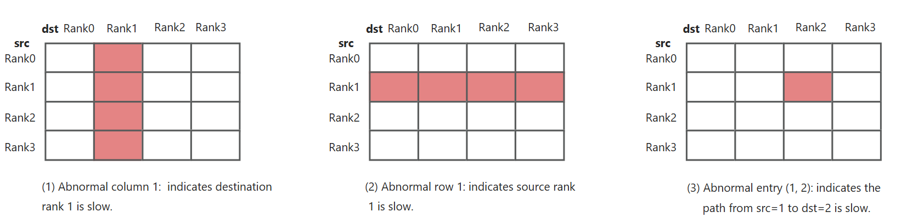
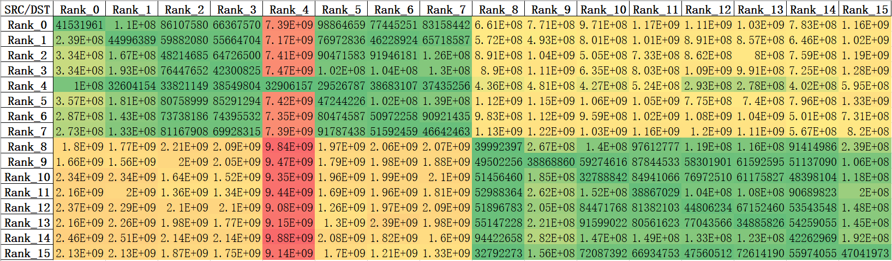
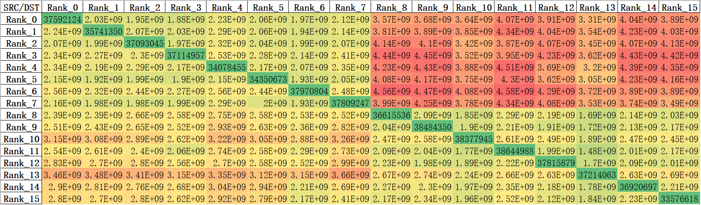

# DeepXTrace

DeepXTrace is a lightweight system tool designed to efficiently and precisely locate slow ranks in DeepEP-based environments by enhancing the [DeepEP](https://github.com/deepseek-ai/DeepEP) communication library. It is composed of two core components: *DeepEP Metrics Probe* and *DeepXTrace Metrics Analysis*.

DeepXTrace supports diagnosis of various slowdown scenarios, including:

* 1. Slowdown caused by the destination rank.
* 2. Slowdown caused by the source rank.
* 3. Slowdown caused by the communication path between specific source and destination ranks.




DeepXTrace automatically collects communication diagnostic metrics for Dispatch/Combine operators across all ranks, while constructing an `N×N` latency matrix `M` on `Rank 0` based on aggregated metrics (where `Mij` represents the delay of `rank_i` waiting for `rank_j`). In the `EP16` scenario, the matrix is categorized by latency magnitude through color gradients, visually revealing a positive correlation between latency data and communication topology, with red > yellow > green indicating increasing latency levels.

The following figure shows the latency matrix for the Dispatch operator's token reception delays across ranks. The relatively high values in the column for `Rank 4` indicate a computational delay issue in `Rank 4`.



The following figure shows the latency matrix for the Combine operator's token reception delays across ranks. No anomalous columns, rows, or points are observed, indicating that the Combine communication operator did not exhibit anomalies during this diagnostic cycle.



##  DeepEP-Metrics-Probe

A low-overhead module for measuring critical diagnostic indicators during DeepEP communication. See also: [DeepEP Diagnose PR](https://github.com/deepseek-ai/DeepEP/pull/311).

## DeepXTrace-Metrics-Analysis

An analysis module that locates the slow rank issues by processing the collected metrics.

### Build
```shell
python setup.py bdist_wheel
```

### Example use in DeepEP Low-Latency (LL) mode

DeepXTrace implements two diagnostic modes: synchronous for maximum accuracy and asynchronous for higher performance, as illustrated in the sample code below.

```python
from deep_ep import Buffer
from deepxtrace import diagnose as ds

_buffer: Optional[Buffer] = None
_diagnose: Optional[ds.Diagnose] = None

def get_buffer(group: dist.ProcessGroup, num_max_dispatch_tokens_per_rank: int, hidden: int, num_experts: int) -> Buffer:
    global _buffer
    num_rdma_bytes = Buffer.get_low_latency_rdma_size_hint(num_max_dispatch_tokens_per_rank, hidden, group.size(), num_experts)
    if _buffer is None or _buffer.group != group or not _buffer.low_latency_mode or _buffer.num_rdma_bytes < num_rdma_bytes:
        assert num_experts % group.size() == 0
        _buffer = Buffer(group, 0, num_rdma_bytes, low_latency_mode=True, num_qps_per_rank=num_experts // group.size())
    return _buffer

# Initialize the diagnostic instance.
def get_diagnose(group: dist.ProcessGroup, enable_async: bool) -> ds.Diagnose:
    global _diagnose
    if _diagnose is None or _diagnose.group != group:
        _diagnose = ds.Diagnose(group = group, enable_async = enable_async)
        # Start the asynchronous diagnosis thread which will periodically perform diagnosis.
        if enable_async:
            _diagnose.start_async_diagnose()
    return _diagnose

# An example of synchronous diagnostic mode.
def diagnose_deepep_sync_mode(hidden_states: torch.Tensor, topk_idx: torch.Tensor, num_max_dispatch_tokens_per_rank: int, num_experts: int, group: dist.ProcessGroup):
        global _diagnose
        # get the diagnose object
        _diagnose = get_diagnose(group = group, enable_async = False)
        # Get the LL dispatch stats tensor.
        dispatch_wait_recv_cost_stats = _diagnose.get_stats_ll_stats_tensor()[0]
        _buffer.low_latency_dispatch(hidden_states, topk_idx, num_max_dispatch_tokens_per_rank, num_experts,
                                     dispatch_wait_recv_cost_stats=dispatch_wait_recv_cost_stats,
                                     use_fp8=True)
        # Get the LL combine stats tensor.
        combine_wait_recv_cost_stats = _diagnose.get_stats_ll_stats_tensor()[1]
        _buffer.low_latency_combine(hidden_states, topk_idx, topk_weights, handle, use_logfmt=use_logfmt,
                                    combine_wait_recv_cost_stats=combine_wait_recv_cost_stats)

        # Perform synchronous diagnosis for low latency (LL) DeepEP mode.
        # Set to perform a diagnosis every 100 steps.
        diagnose_res = _diagnose.diagnose_ll_sync(diagnose_step = 100)
        # Note: diagnosis results will be gathered to rank0.
        if rank == 0:
            print(diagnose_res)

# An example of asynchronous diagnostic mode.
def diagnose_deepep_async_mode(hidden_states: torch.Tensor, topk_idx: torch.Tensor, num_max_dispatch_tokens_per_rank: int, num_experts: int, group: dist.ProcessGroup):
        global _diagnose
        # Note: In asynchronous mode, the diagnostic results will be periodically output in the
        #       background diagnostic thread of rank0. 
        # Get the diagnose object.
        _diagnose = get_diagnose(group = group, enable_async = True)

        # Get the LL dispatch stats tensor.
        dispatch_wait_recv_cost_stats = _diagnose.get_stats_ll_stats_tensor()[0]
        _buffer.low_latency_dispatch(hidden_states, topk_idx, num_max_dispatch_tokens_per_rank, num_experts,
                                     dispatch_wait_recv_cost_stats=dispatch_wait_recv_cost_stats,
                                     use_fp8=True)
        # Get the LL combine stats tensor.
        combine_wait_recv_cost_stats = _diagnose.get_stats_ll_stats_tensor()[1]
        _buffer.low_latency_combine(hidden_states, topk_idx, topk_weights, handle, use_logfmt=use_logfmt,
                                    combine_wait_recv_cost_stats=combine_wait_recv_cost_stats)
```
